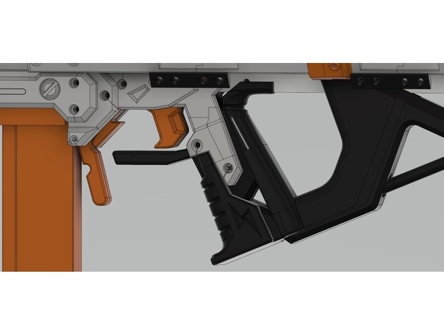

A beavertail grip for the Indra. This addition to the grip prevents getting "bit" in the hand by the trigger-catch linkage bar.

There is also a version of the grip without the bottom "toe" of the grip.

