This is a set of 4 stock spacers for the Indra! They extend the stock by 0.8 inches, 1 inch, 1.5 inches, or 2 inches.

If you want, you can print the stockspacer part and use it as a hole drilling guide on an existing bButt print instead of printing the new bButt print with the holes already in it.

These use 6 4-40 screws. I also made a version that uses 3 10-32 long screws, but I think thats really overbuilt. If people break these, then I'll release that.

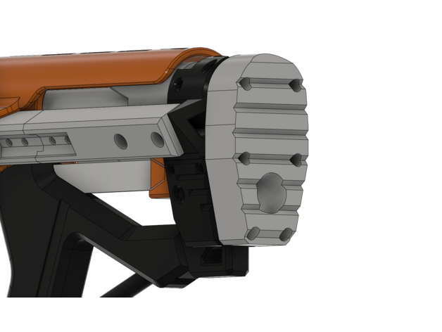

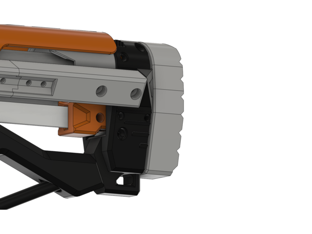

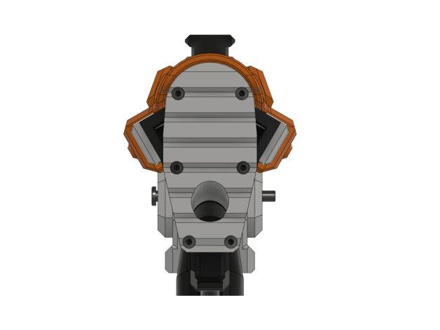

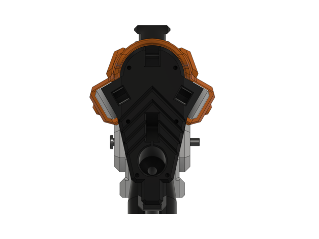

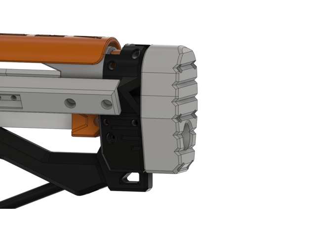

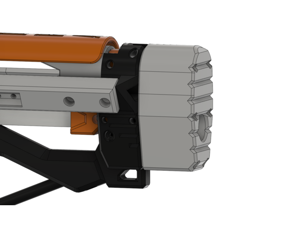

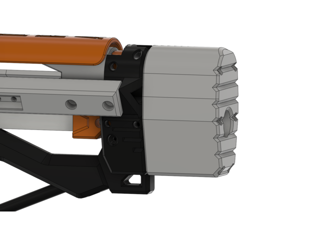

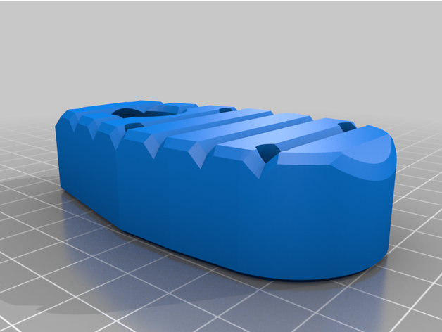

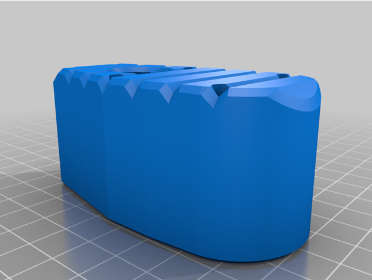

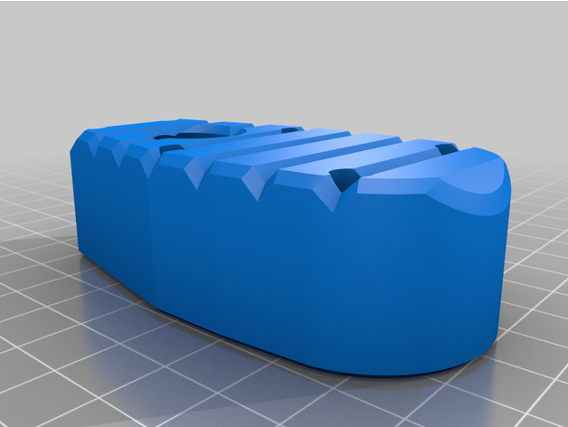

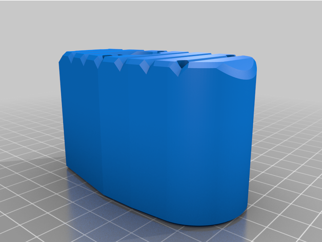

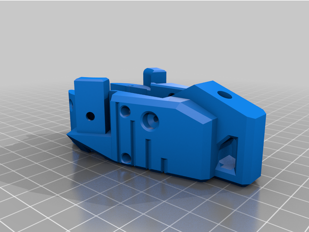
