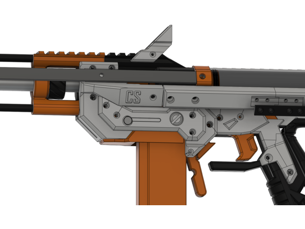
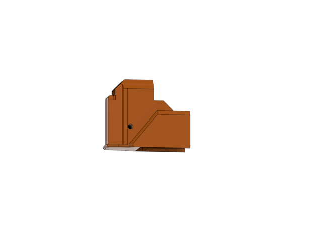
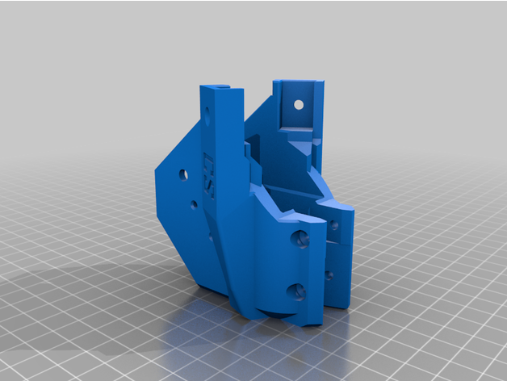
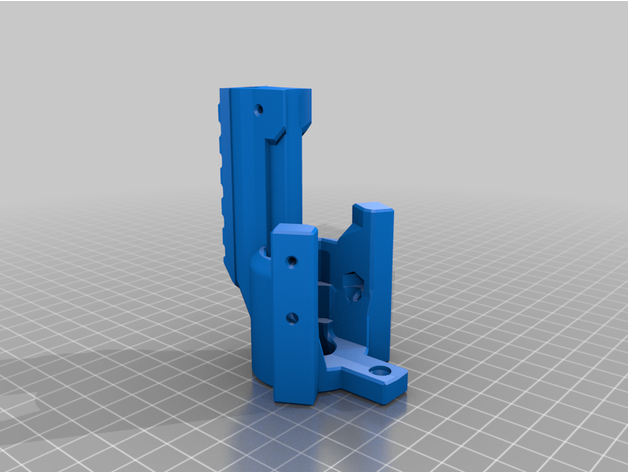
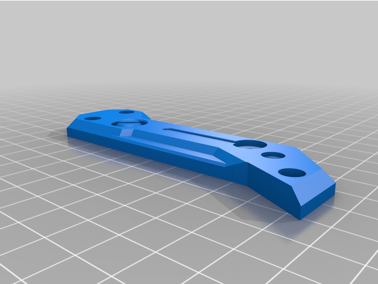
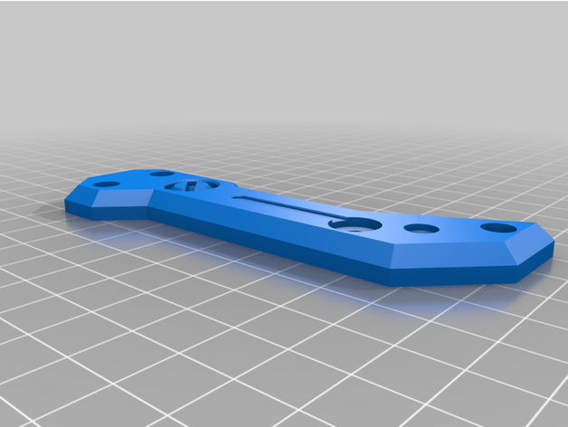
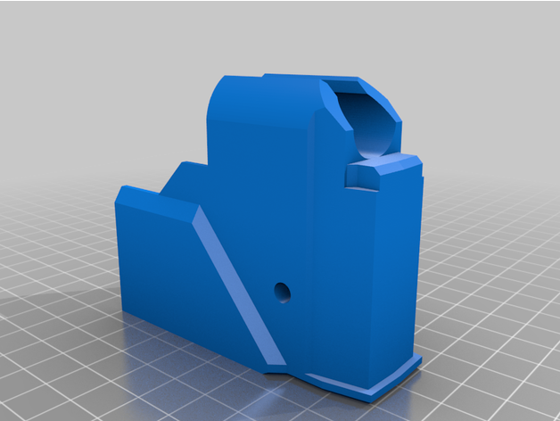
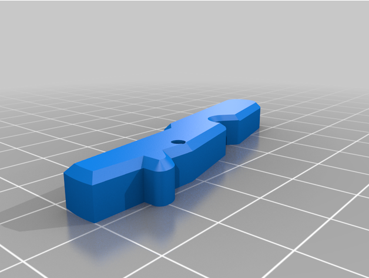
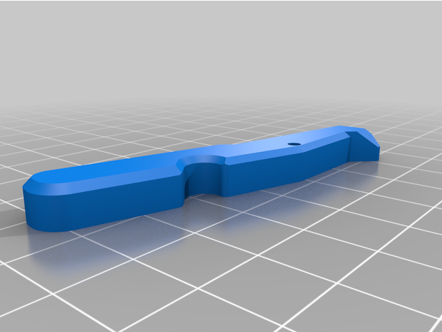
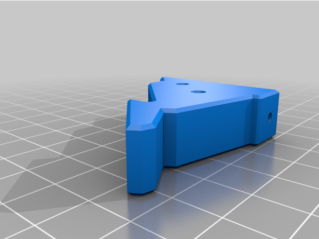

This is a passive Talon magwell, similar to the one for the Caliburn made by CaptainSlug.

This system uses 2 mag releases, like a wildcard adapter. However, instead of Talon and Katana mags, the two releases work on Talon and full length magazines. An adapter insert is used when you wish to use Talon mags, and removed to use full length magazines.

This kit replaces the BMag right, left, front, and core, as well as the mag releases and midblock.

The BMag right, left, and front changes are just to facilitate the use of a takedown pin for the insert, so you could just drill a properly sized hole into existing prints.

https://www.youtube.com/watch?v=HK3Jz8W2OEU

