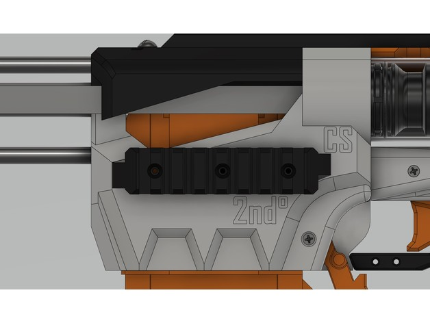
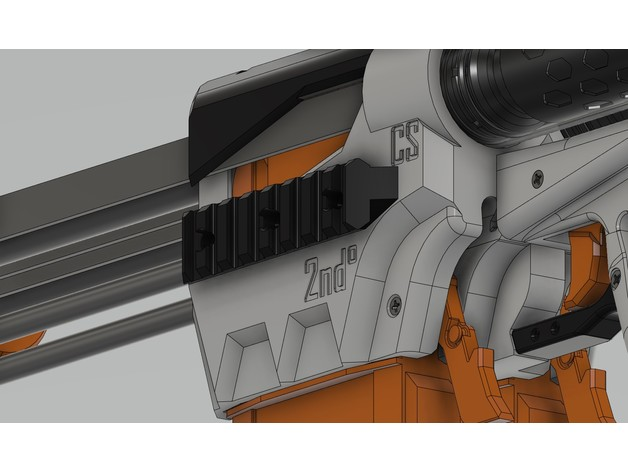
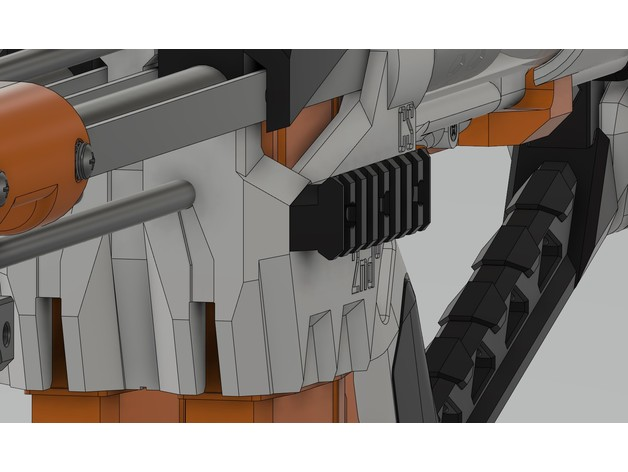
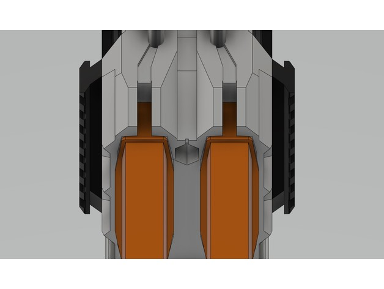
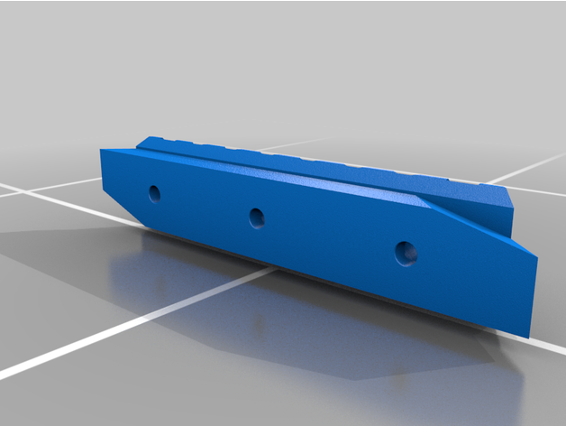
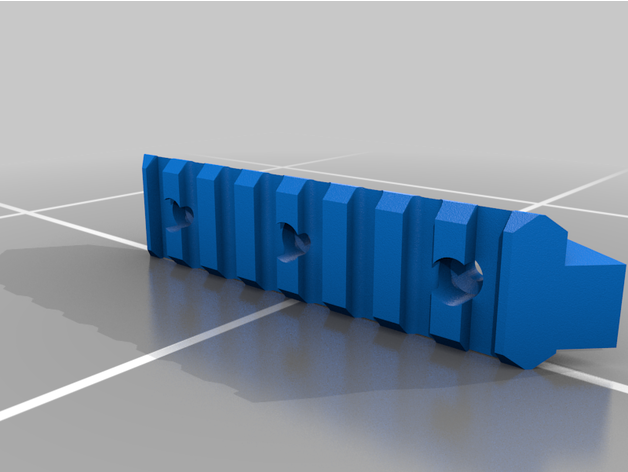
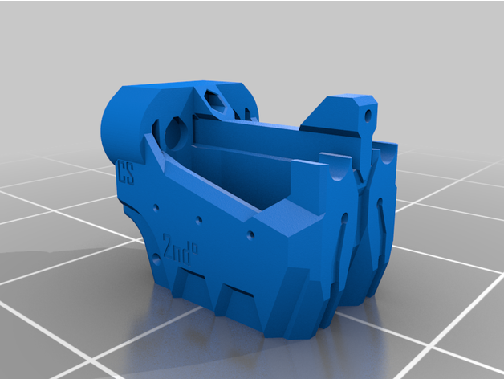

A 2nd-DegreeBurn magwell with picatinny rails on the left and right sides.  Uses 3 4-40 screws per rail.

This is a small piece that lets you put 1/2in CPVC over or under a piece of 1/2in PVC. Used for stabilizing floppy CPVC with sturdy PVC for long length CPVC barrels.

