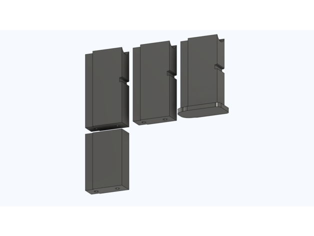
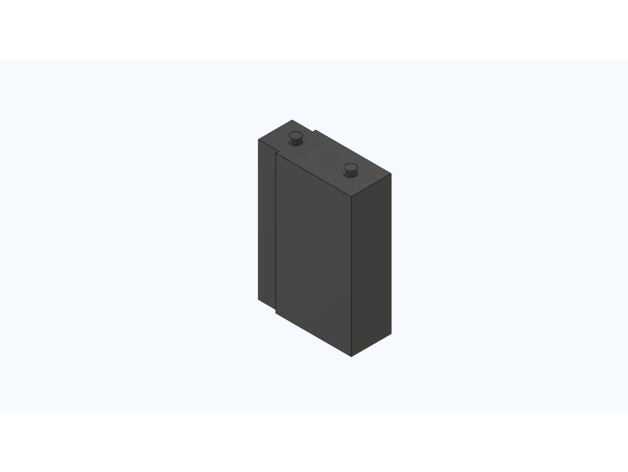
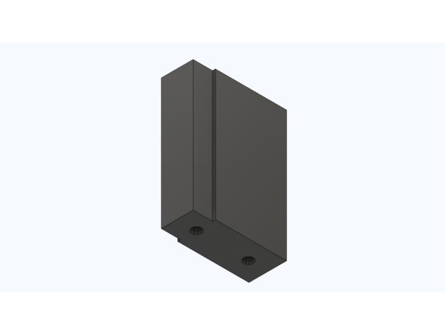
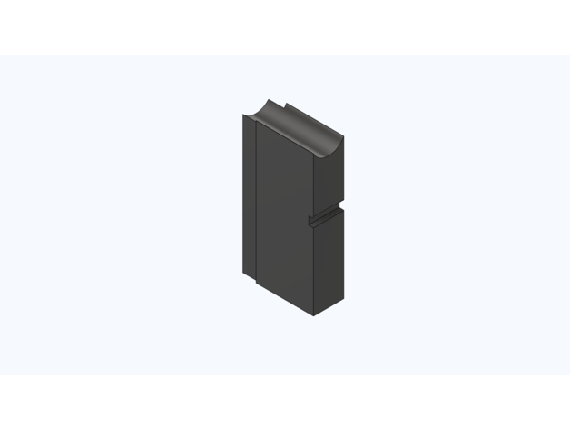
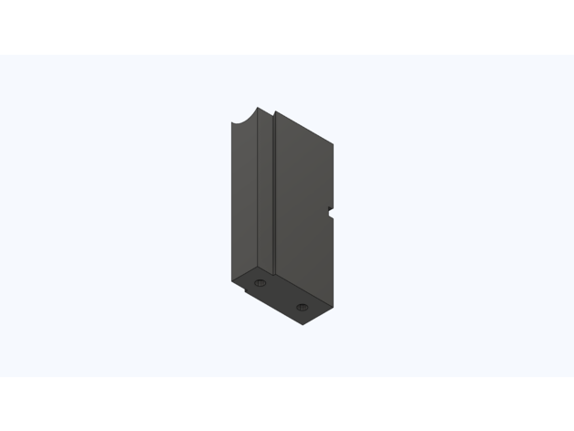
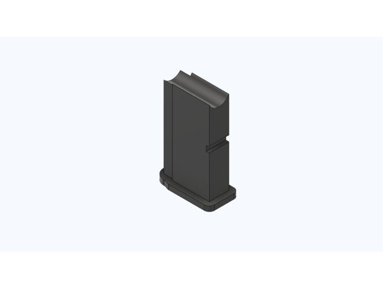
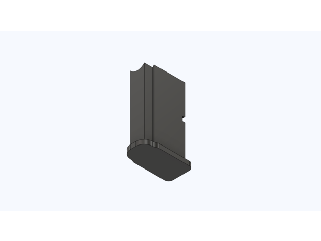
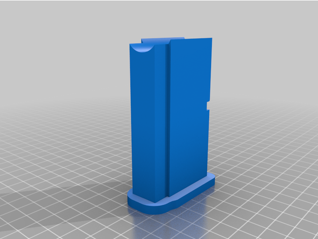
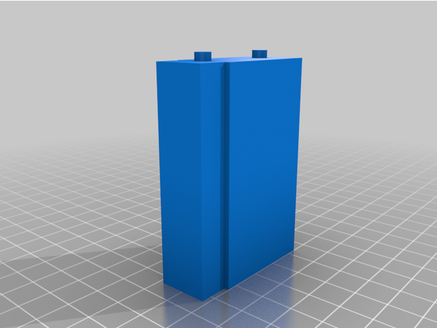
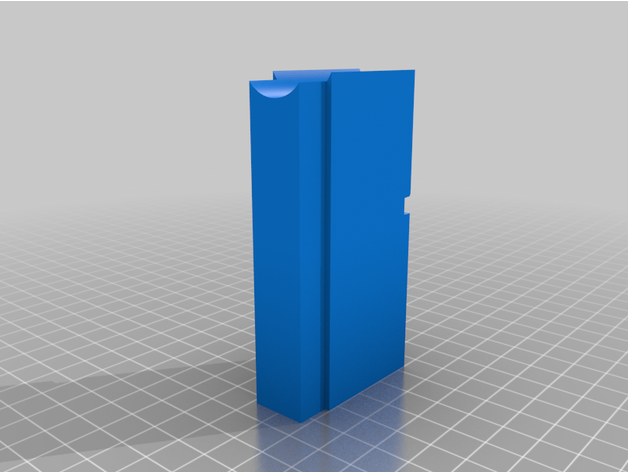

This is a dummy Talon mag for filling mag space if you are single-loading your blaster.

The top of this mag doesn't line up to the chamber due to the way Talon mags feed, but it does stop you from dropping the dart through the bottom of the blaster.

There are 2 versions of this mag; one with a lip/brim on the bottom, and one without a lip/brim. There is also an extension piece that can be printed and glued to the 'brimless' mag to make it longer if need be.

If you don't like the slight jiggle that the mag has in some magwells, jam a folded piece of paper between the side of the mag and the magwell. That is assuming that you leave the mag in the whole time you are playing.

This design is perfectly fine to print at low infill. I printed mine at 10% Gyroid, 3 walls. 

